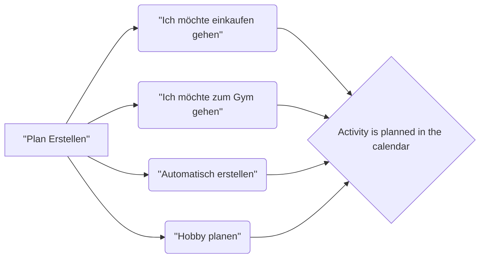

# Welcome to StackEdit!
MonPlany is skill that plans everything you want for you without needing to ask about time.

## Videos:
[Plan a specific activity]()
[Plan automatically]()

## Requirements:

- NodeJs
- flask
- skill-sdk
- MongoDB

## Setup
1) A mongoDB server should be running 
```bash
systemctl status mongo
```
should return an active mongoDB server. Else
```bash
systemctl start mongo
```

2) Start the backend REST api:
```bash
python skill-monplany-python/external/monplany_calendar_rest_api.py
```
3) Start the web application:
```bash
cd monplany
npm install
ng serve
```

4) Start the skill:
```bash
python skill-monplany-python/manager.py run
```


## How to use


